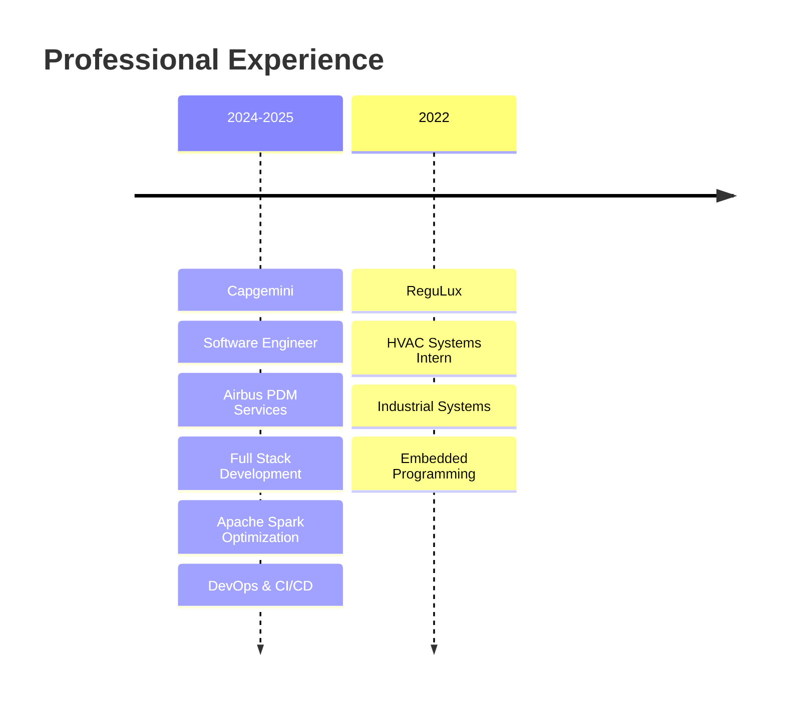

# 🚀 Youssef EL ALAMI

<div align="center">
  
```ascii
██╗   ██╗ ██████╗ ██╗   ██╗███████╗███████╗███████╗███████╗
╚██╗ ██╔╝██╔═══██╗██║   ██║██╔════╝██╔════╝██╔════╝██╔════╝
 ╚████╔╝ ██║   ██║██║   ██║███████╗███████╗█████╗  █████╗  
  ╚██╔╝  ██║   ██║██║   ██║╚════██║╚════██║██╔══╝  ██╔══╝  
   ██║   ╚██████╔╝╚██████╔╝███████║███████║███████ ██║     
   ╚═╝    ╚═════╝ ╚═════╝ ╚══════╝╚══════╝╚══════╝ ╚═╝     

```

  
  
  

  [](https://www.linkedin.com/in/youssef-el-alami-/)
  [](mailto:youssef2003elalami@gmail.com)
  [](https://github.com/YoussefELALAMI)
  
  
  
</div>

---


## 👨‍💻 About Me

> *"Crafting scalable solutions with passion and precision"*

🎯 **Software Engineer** @ **Capgemini** working on Airbus PDM Services  
📍 **Toulouse, France** 🇫🇷  
🎓 **Engineering Student** @ ENSEEIHT - INP Toulouse  
🌐 **Languages**: Français • English (C1+) • العربية  

### 🔥 What Drives Me
- 🚀 Building **high-performance applications** with modern architectures
- 📊 Transforming **complex data** into actionable insights
- ☁️ Exploring **cloud-native** solutions and DevOps practices
- 🤝 Fostering **collaborative development** in agile environments
- 📚 Embracing **continuous learning** and emerging technologies

<br clear="right"/>

---

## 🛠️ Tech Arsenal

<div align="center">

### 🎯 **Core Expertise**

<table>
  <tr>
    <td align="center" width="200px">
      <br>
      <sub><b>Backend Mastery</b></sub><br>
      <sub>Java • Spring Boot • REST APIs</sub>
    </td>
    <td align="center" width="200px">
      <br>
      <sub><b>Frontend Excellence</b></sub><br>
      <sub>Angular • TypeScript • React</sub>
    </td>
    <td align="center" width="200px">
      
      <br>
      <sub><b>Data Engineering</b></sub><br>
      <sub>Apache Spark • ETL • Analytics</sub>
    </td>
    <td align="center" width="200px">
      <br>
      <sub><b>Cloud & DevOps</b></sub><br>
      <sub>AWS • Docker • CI/CD</sub>
    </td>
  </tr>
</table>

### 💻 **Technology Stack**


</div>

---

## 📊 GitHub Analytics

<div align="center">
  
  
  
  

</div>

<div align="center">
  
</div>

<div align="center">
  
</div>

---

## 🎯 Featured Projects

<div align="center">
  
  

</div>

### 🤖 **GuessMoji** - AI-Powered Interactive Game
[](https://github.com/YoussefELALAMI/guessmoji)

**Tech Stack**: Angular • Python Flask • OpenAI API  
**Highlights**: Real-time AI integration • Responsive UI • Modern web architecture

### 🌱 **Plantagon** - IoT Monitoring Solution
[](https://github.com/YoussefELALAMI/Plantagon)

**Tech Stack**: React • Node.js • Raspberry Pi • IoT Sensors  
**Highlights**: Real-time monitoring • Hardware integration • Dashboard analytics

### 🎓 **Academic Portfolio**
[](https://github.com/YoussefELALAMI/ENSEIHT)

**Tech Stack**: Various • Algorithms • Software Engineering  
**Highlights**: Academic excellence • Diverse technologies • Problem-solving

### 🧩 **Coding Challenges**
[](https://github.com/YoussefELALAMI/coding-challenges)

**Focus**: Algorithm optimization • Data structures • Competitive programming  
**Languages**: Java • Python • JavaScript

---

## 💼 Professional Journey

<div align="center">
  


</div>

### 🏢 **Capgemini** - Software Engineer *(2024-2025)*
**🚁 Airbus PDM Services Project**

- 🎯 **Full Stack Development**: Architected Angular frontends with Spring Boot microservices
- ⚡ **Performance Optimization**: Enhanced Apache Spark data processing pipelines by 40%
- 🔄 **DevOps Excellence**: Streamlined Jenkins CI/CD workflows for automated deployments
- 🧪 **Quality Assurance**: Implemented comprehensive testing strategies with 90%+ coverage
- 👥 **Agile Leadership**: Facilitated SAFe ceremonies and cross-functional collaboration

### 🏭 **ReguLux** - HVAC Systems Intern *(2022)*
- 🌡️ **Industrial IoT**: Developed embedded temperature control systems
- 📊 **System Integration**: Connected hardware sensors with monitoring dashboards

---

## 🎓 Education & Certifications

<div align="center">

| 🏛️ **Institution** | 📚 **Program** | 📅 **Year** | 🏆 **Achievement** |
|:---:|:---:|:---:|:---:|
| **ENSEEIHT INP-Toulouse** | Software Engineering Master | 2022-2025 | 🎯 Specialized Track |
| **IUT Henri Poincaré** | Electronics & Industrial IT | 2020-2022 | 🏅 Honor Roll |
| **Dalarna University** 🇸🇪 | Erasmus Exchange | 2022 | 🌍 International Experience |
| **Cambridge English** | Business English Certification | 2025 | 📜 C1+ Level |
| **AWS** | Cloud Practitioner | 2025 | ☁️ *In Progress* |

</div>

---

## 🌟 Current Focus

<div align="center">

```yaml
current_projects:
  - Airbus PDM Services Enhancement
  - AWS Cloud Architecture Certification
  - Advanced Microservices Patterns

learning_path:
  - Kubernetes & Container Orchestration
  - Event-Driven Architecture
  - ML/AI Integration in Enterprise Systems

collaboration_interests:
  - Open Source Contributions
  - Full Stack Innovation Projects
  - Cloud-Native Solutions
  - Data Engineering Challenges
```

</div>

---

## 🌍 Beyond the Code

<div align="center">
  
  

</div>

**🏋️ Calisthenics Athlete** | Active member of *Toul'Barz* association  
**🌎 Cultural Explorer** | International experiences fostering global perspective  
**🧠 Tech Evangelist** | Passionate about sharing knowledge and mentoring  
**📈 Growth Mindset** | Constantly pushing boundaries and embracing challenges

---

## 💬 Let's Build Something Amazing

<div align="center">

> **"In a world driven by technology, I believe in creating solutions that not only work flawlessly but also inspire innovation and drive meaningful impact."**

### 🤝 Open to Collaboration On:
- 🚀 **Enterprise Applications** with modern architectures
- 📊 **Data Engineering** projects and analytics platforms  
- ☁️ **Cloud Migration** and scalability challenges
- 🌱 **Open Source** initiatives and community projects

---

### 📍 **Location**: Toulouse, France 🇫🇷
### 📧 **Contact**: [youssef2003elalami@gmail.com](mailto:youssef2003elalami@gmail.com)
### 🔗 **Connect**: [LinkedIn](https://www.linkedin.com/in/youssef-el-alami-/)

[](https://github.com/YoussefELALAMI)
[](https://github.com/YoussefELALAMI)

---


**"Code with purpose, build with passion, innovate with impact"** ⚡

*Fueled by ☕, driven by curiosity, and committed to excellence*

</div>
