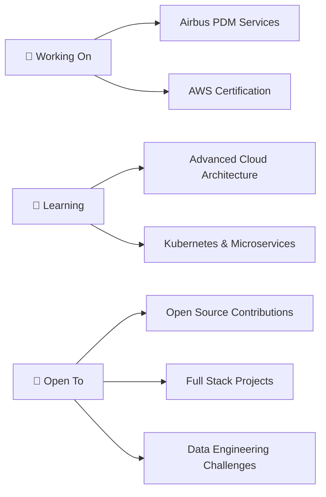

# 🚀 Salut! I'm Youssef EL ALAMI

<div align="center">
  
  
  
  
  
  [](https://www.linkedin.com/in/youssef-el-alami-/)
  [](mailto:youssef2003elalami@gmail.com)
  [](https://github.com/YoussefELALAMI)
  
</div>

---

## 👨‍💻 About Me

```java
@Component
public class YoussefElAlami implements SoftwareEngineer {
    
    private final String name = "Youssef EL ALAMI";
    private final String currentRole = "Software Engineer @ Capgemini";
    private final String project = "Airbus PDM Services";
    private final String location = "Toulouse, France 🇫🇷";
    private final List<String> languages = Arrays.asList("Français", "English (C1+)", "العربية");
    
    @Override
    public Map<String, Object> getExpertise() {
        return Map.of(
            "backend", Arrays.asList("Java Spring Boot", "Python OOP", "REST APIs"),
            "frontend", Arrays.asList("Angular", "TypeScript", "React"),
            "data", Arrays.asList("Apache Spark", "ETL", "SQL Optimization"),
            "devops", Arrays.asList("Jenkins CI/CD", "Docker", "Git Workflow"),
            "cloud", Arrays.asList("AWS (Cloud Practitioner)", "GCP Basics"),
            "methodologies", Arrays.asList("SAFe Agile", "TDD", "Clean Architecture")
        );
    }
    
    @Override
    public String getMotivation() {
        return "Passionate about crafting scalable solutions and continuous learning 🌟";
    }
}
```

---

## 🛠️ Professional Tech Stack

<div align="center">

### 💼 **Currently Working With @ Capgemini**


### 🏗️ **Backend & Data Engineering**


### 🎨 **Frontend Development**


### ☁️ **DevOps & Cloud**


### 🧪 **Testing & Quality**


</div>

---

## 📊 GitHub Analytics

<div align="center">
  
  
  
  

</div>

<div align="center">
  
</div>

---

## 🎯 Featured Projects

<div align="center">

[](https://github.com/YoussefELALAMI/guessmoji)
*🤖 AI-Powered Interactive Web App | Angular + Python Flask + OpenAI API*

[](https://github.com/YoussefELALAMI/Plantagon)
*🌱 IoT Real-Time Monitoring Solution | React + Node.js + Raspberry Pi*

[](https://github.com/YoussefELALAMI/ENSEIHT)
*🎓 Academic Projects Collection | Various Technologies & Algorithms*

[](https://github.com/YoussefELALAMI/coding-challenges)
*🧩 Algorithm Practice & Problem Solving | Multiple Languages*

</div>

---

## 💼 Professional Experience

<div align="center">

### 🏢 **Capgemini** - *Software Engineer* (2024-2025)
**Airbus PDM Services Project**
- 🔧 **Full Stack Development**: Angular frontends with Spring Boot REST services
- ⚡ **Data Processing**: Apache Spark optimization & ETL pipeline development  
- 🚀 **DevOps**: Jenkins CI/CD pipelines & GitLab workflow management
- 🧪 **Quality Assurance**: JUnit testing & code review processes
- 👥 **Agile Collaboration**: SAFe methodology with cross-functional teams

### 🏭 **ReguLux** - *HVAC Systems Intern* (2022)
- 🌡️ **Industrial Systems**: Embedded temperature control systems discovery

</div>

---

## 🎓 Education & Certifications

<div align="center">

| 🏛️ **Institution** | 📚 **Degree/Certification** | 📅 **Period** |
|:---:|:---:|:---:|
| **ENSEEIHT INP-Toulouse** | Software Engineering Master | 2022-2025 |
| **IUT Henri Poincaré** | Electronics & Industrial IT | 2020-2022 |
| **Dalarna University** 🇸🇪 | Erasmus Exchange | Jan-Apr 2022 |
| **Cambridge English** | Business English C1+ | 2025 |
| **AWS** | Cloud Practitioner *(In Progress)* | 2025 |
| **Airbus/VersionOne** | Agility Foundation | 2024 |

</div>

---

## 🌍 Current Focus & Goals

<div align="center">



</div>

---

## 📈 Contribution Activity

<div align="center">
  
</div>

---

## 🌟 Beyond Code

<div align="center">

**🏋️ Calisthenics Enthusiast** | Active member of *Toul'Barz* association in Toulouse

**✈️ Cultural Explorer** | International travel experiences fostering adaptability & cross-cultural communication

**🧠 Continuous Learner** | Always exploring new technologies and engineering practices

</div>

---

## 💬 Let's Connect!

<div align="center">

I'm always excited to discuss **software architecture**, **data processing**, **cloud technologies**, or collaborate on **innovative projects**!

*Currently based in **Toulouse, France** 🇫🇷*

[](https://github.com/YoussefELALAMI)


---


**"Building robust solutions through clean code and continuous innovation"** ✨

*Powered by ☕ and endless curiosity*

</div>
